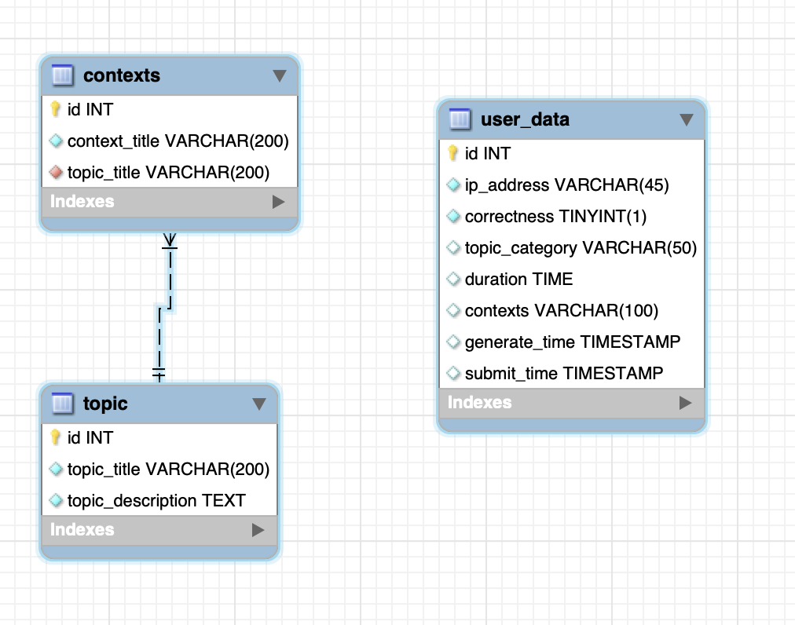

# CodeCraft Backend

## Project Background/Overview
CodeCraft's backend is built with Spring Boot 3, providing robust server-side functionality for the CodeCraft learning platform. It handles user data management, coding challenge generation, and integration with various services including MySQL database and Gemini LLM API.

## Demo
Visit our deployed application: [CodeCraft Platform](http://54.252.5.239/)

## Features (User Stories by Sprint)

### Sprint 1: Initial Implementation
- Implementation of data transaction between backend and frontend using Spring Boot
- First draft version of the question page deployment

### Sprint 2: Core Functionality Development
- Integration of predefined topics and context selection
- Topic and context selection Database
- Question answer tracking table
- Comprehensive API development for core features

### Sprint 3: Refinement and Enhancement
- Refined logical flow in question answering process
- Enhanced feedback response system
- Real-time current question feedback implementation
- Updated backend API integration with new frontend features
  
## Documentation
- Access our complete documentation on [Confluence](https://student-team-zjyi1h63.atlassian.net/wiki/spaces/0D/overview) (Requires permission)
- Documentation includes:
  - Detailed user stories
  - System architecture
  - Test cases
  - API documentation

## System Requirements

### Tools & Technologies
- MySQL (database)
- Docker (for Python environment)
- Java Development Kit (JDK)
- Maven
- Git (optional - for version control)

### Tech Stack Versions
- Spring Boot 3
- MySQL
- Gemini LLM API
- Docker
- JUnit (Testing)

## Installation Guide

### Prerequisites
1. Ensure all required software is installed
2. Clone the backend repository

### Docker Setup
```bash
docker pull rita6667/gemini-app:latest
```

### Backend Setup
1. Build the project:
```bash
mvn clean package -DskipTests
```

2. Navigate to the target directory:
```bash
cd UserDatabase/target
```

3. Run the JAR file:
```bash
java -jar UserDatabase-0.0.1-SNAPSHOT.jar --server.port=8080
```

## System Architecture

### Application Layers

#### 1. Controller Layer
- Handles HTTP requests and processes them according to application logic
- Contains specialized controllers for AI, topics, and users
- Located in `UserDatabase/src/main/java/com.parsons.controller`

#### 2. Service Layer
- Manages business logic processing
- Handles user data, topics, and contexts
- Executes operations and data transformations

#### 3. Data Access Layer (Mapper)
- Interfaces with the database using MyBatis
- Configuration specified in `myBatis-config.xml`
- Manages all database operations

#### 4. Configuration Layer
- Contains application settings in `application.yaml`
- Includes additional configurations in the `config` directory

## Entity Relationship Diagram

The following ER diagram illustrates the database structure of the CodeCraft backend system:



### Key Classes

#### AIController
Location: `UserDatabase/src/main/java/com.parsons.controller`
- Manages Gemini functionality
- Handles question generation using topics and context as prompts

#### TopicController
Location: `UserDatabase/src/main/java/com.parsons.controller`
- Manages topic and context retrieval
- Handles CRUD operations for topics
- Interfaces with database for topic information

#### UserController
Location: `UserDatabase/src/main/java/com.parsons.controller`
- Manages user data operations
- Handles user information creation and retrieval
- Coordinates between service and data access layers

#### ParsonsApp
Location: `UserDatabase/src/main/java/com.parsons`
- Main application class
- Initializes Spring Boot application
- Configures component scanning

### Database Structure

#### Database: parsons_data_db

##### Table: user_data
Purpose: Stores user interaction data
Fields:
- `id` (Primary Key)
- `ip_address`
- `correctness`
- `topic_category`
- `duration`
- `contexts`
- `generate_time`
- `submit_time`

##### Table: topic
Purpose: Stores topic information
Fields:
- `id` (Primary Key)
- `topic_title` (Unique)
- `topic_description`

##### Table: contexts
Purpose: Stores context information for topics
Fields:
- `id` (Primary Key)
- `context_title`
- `topic_title` (Foreign Key → topic.topic_title)
  - Includes ON DELETE CASCADE

#### Relationships
- Topics to Contexts: One-to-Many
- Referential integrity maintained through cascade deletions
- User data maintained independently

### Deployment Steps
1. Generate JAR file:
```bash
./mvnw clean package -DskipTests
```
2. Upload the packaged JAR file to your hosting platform
3. Update any `localhost` references to your hosting platform's public IP address

# Changelog

## Version 1.2 (November 2024)
- Updated ER diagram and system architecture
- Improved file directory structure
- Added code formatting and whitespace handling

## Version 1.1 (October 2024)
- Enhanced code generation and verification system
- Implemented hint generation functionality
- Added JSONException handling in AI Controller
- Restructured controller layer with combined Problem/IDE checking

## Version 1.0 (September 2024)
- Released core IDE features with AI integration
- Implemented secure IP address encryption
- Added CSV file generation and storage
- Integrated database system with jar module support
- Completed data transport layer between components

## Version 0.2 (September 2024)
- Implemented Python IDE core functionality
- Added Topic and Context mapping
- Created admin user management system
- Integrated Docker environment for Python

## Version 0.1 (August 2024)
- Initial AI Generation system implementation
- Basic Topic Selection functionality
- Database schema design
- Initial system architecture setup

## Version 0.0 (August 2024)
- Project initialization
- Basic repository setup
- Initial documentation

## Additional Information

### Security and Ethics
- User Privacy Protection with anonymized IP addresses
- Secure, encrypted database storage
- Ethical AI content generation
- Equitable access and open-source compliance

### Contributors
- Howard Li (howard3@student.unimelb.edu.au)
- Yiru Liu (yirul6@student.unimelb.edu.au)
- Yan Gong (yagong1@student.unimelb.edu.au)
- Jiayi Wang (jiawang10@student.unimelb.edu.au)
- Yifan Zhang (yifanzhang@student.unimelb.edu.au)

### License
This project is licensed under the MIT License. See the [LICENSE](LICENSE) file for details.
